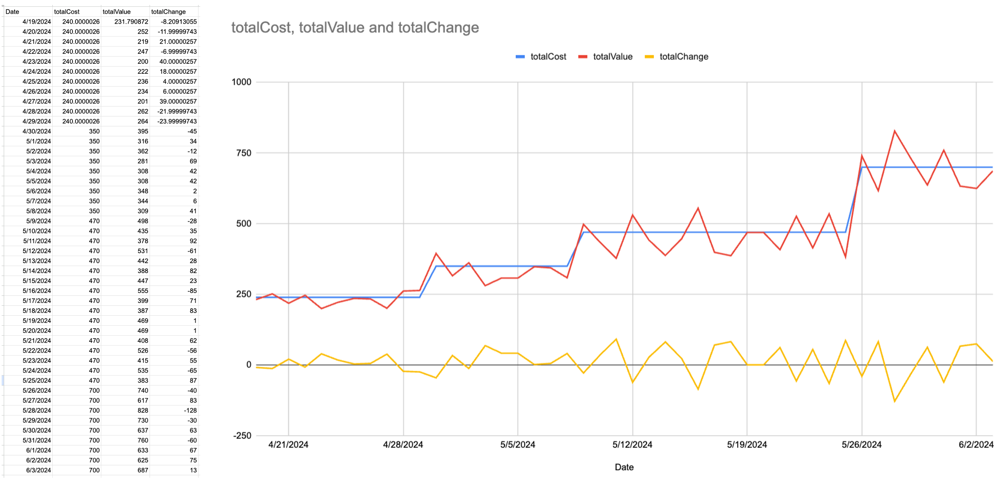

This project aims to keep your mannual documentation of your financial investment in the Stock Market to minimal.

---

### Initial Setup:

- Requires the use of GoogleSheets for easy GoogleFinance integration.
- Import your portfolio based on the structure & equations used in [example](example-sheets.xlsx)
- Integrate the JavaScript code as .gs files in Extentions -> App Scripts.
- Set your automatic triggers for script execution (i.e. hourly, daily, etc..)

---

### Maintance:

- You will need to manually update your Porfolio based on your recent purchases.

---

### Suggestion:

For optimal results: - Trigger of data-collect = daily @ x - Trigger of chart-update = daily @ x + 1h

